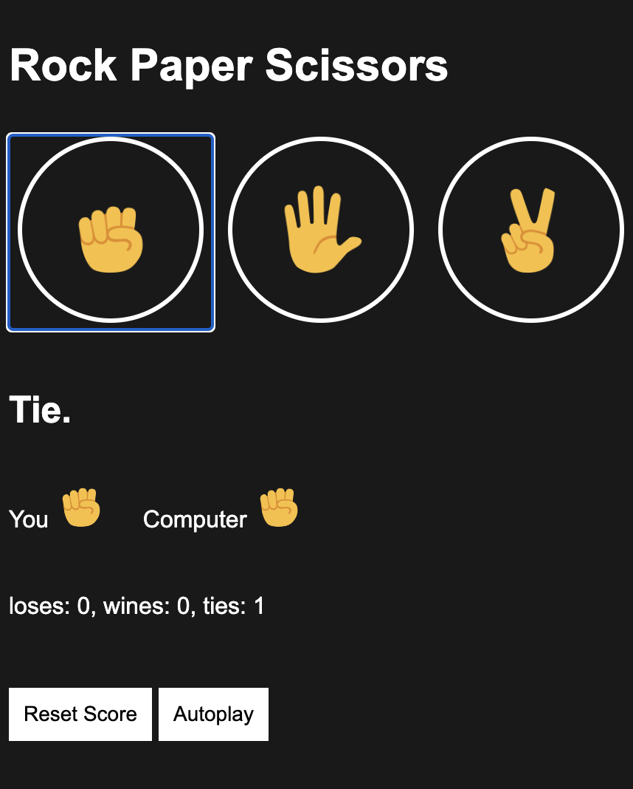

# Rock-Paper-Scissors

A web-based Rock-Paper-Scissors game implemented using HTML, CSS, and JavaScript.

  

## Description

Rock-Paper-Scissors is a classic game where players choose one of three options: rock, paper, or scissors. This project brings the game to your browser, allowing you to play against the computer.

## Features

- Interactive gameplay: Click on the buttons or use the keyboard shortcuts (R for rock, P for paper, and S for scissors) to select your move.
- AutoPlay: Enable AutoPlay mode to have the computer automatically play against itself.
- Score tracking: The game keeps track of the number of wins, losses, and ties.
- Reset score: Reset the score to start a new game.
- Visual feedback: Each move is represented by an emoji icon for better user experience.

## Game Rules

The rules of Rock-Paper-Scissors are simple:

- Rock beats scissors.
- Scissors beats paper.
- Paper beats rock.

To play the game, choose one of the options (rock, paper, or scissors) and see if you win, lose, or tie against the computer's choice.

## How to Play

1. Open the Rock-Paper-Scissors game in your web browser.
2. Click on the buttons to choose your move or use the keyboard shortcuts (R, P, S).
3. The computer will randomly select its move.
4. The result of the round will be displayed, indicating whether you win, lose, or it's a tie.
5. The score will be updated accordingly.
6. You can enable AutoPlay mode by clicking the "AutoPlay" button.
7. To reset the score, click the "Reset Score" button.

## Installation

1. Clone the repository or download the project files.
2. Open the `index.html` file in your web browser.

## Technologies Used

- HTML
- CSS
- JavaScript

## Credits

This project was created by Fatemeh Karami. Feel free to use and modify the code according to your needs.
